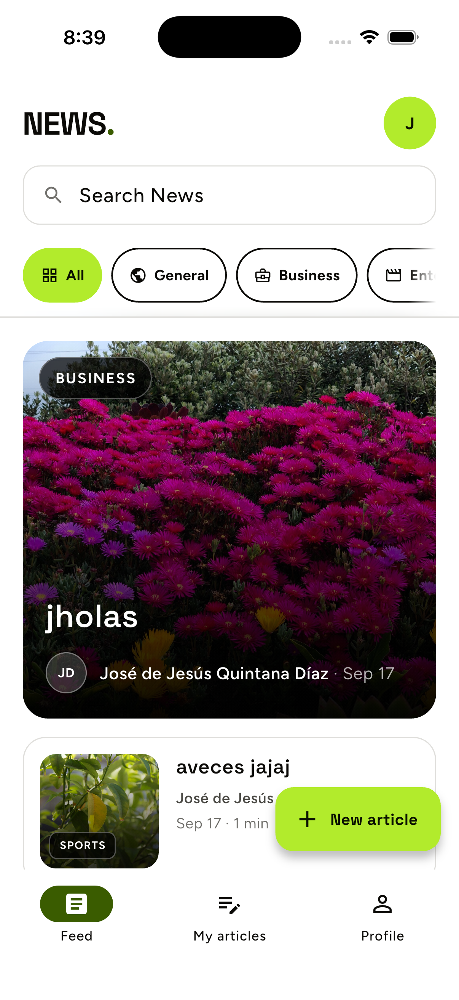
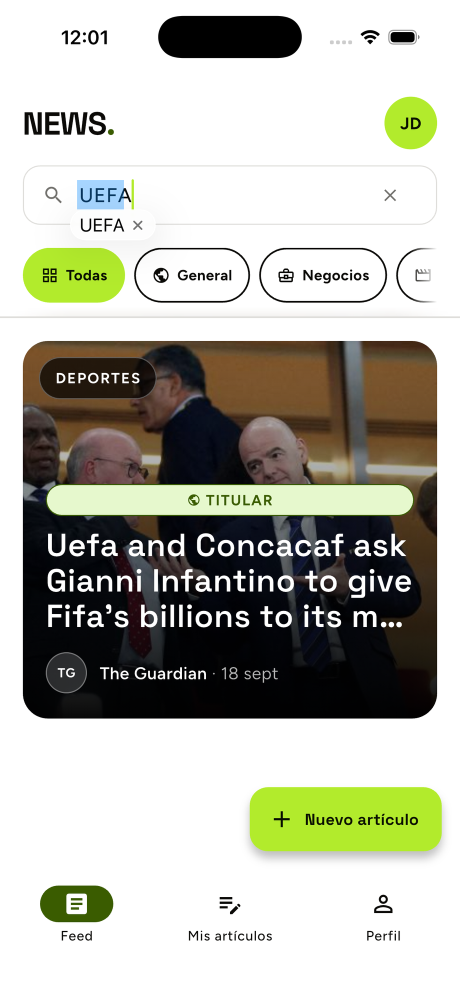
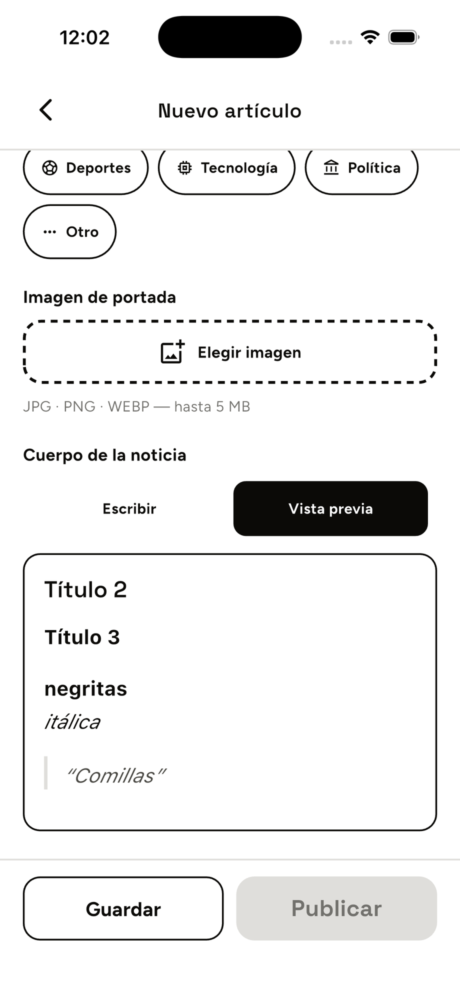
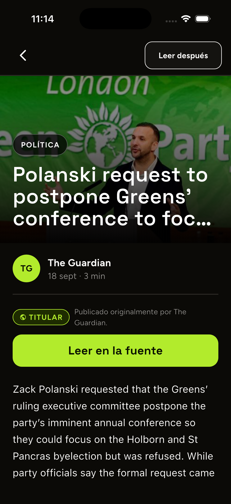
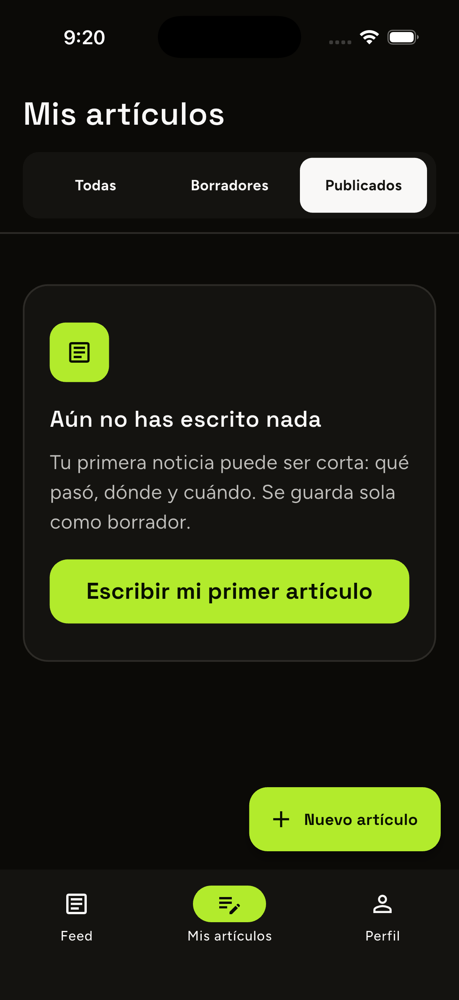
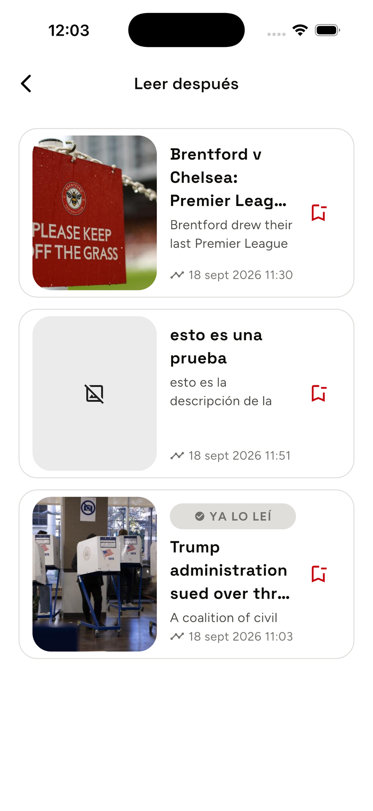
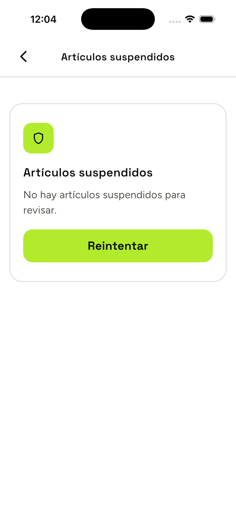
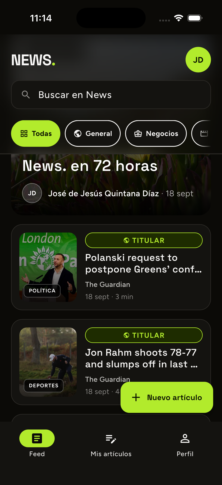
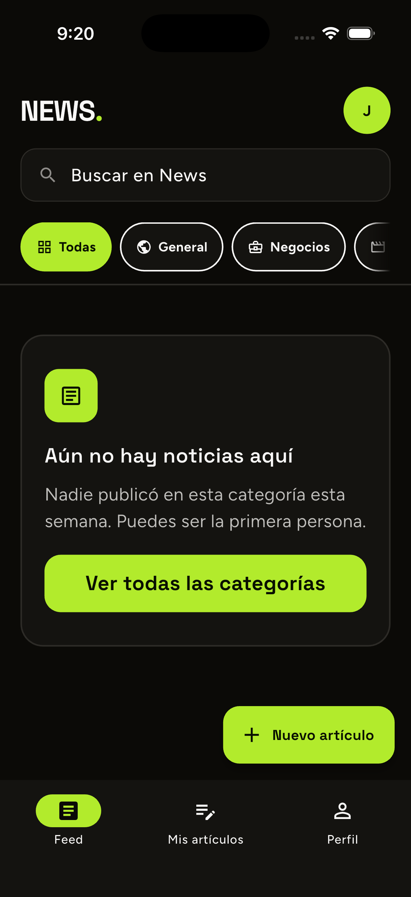

# Report — Applicant Showcase App

Este documento sigue las 7 secciones de [`REPORT_INSTRUCTIONS.md`](./REPORT_INSTRUCTIONS.md).
Cada cifra citada aquí se corrió y verificó el 2026-09-18, en la misma sesión
en la que se escribió este documento — no se copió del historial de trabajo
(`ROADMAP.md`, que vive en la raíz del repo y documenta el proceso completo
fase por fase, decisiones incluidas).

## 1. Introducción

El punto de partida era, literalmente, un proyecto que no compilaba. El
`pubspec.yaml` del starter declaraba `sdk: ">=2.16.1 <3.0.0"` mientras
`pubspec.lock` resolvía dependencias que exigen Dart ≥3.3 — con Flutter
moderno, `flutter pub get` fallaba antes de escribir una sola línea propia.
El repositorio no tenía ni un commit. `backend/.firebaserc` traía JSON
inválido y `backend/firestore.indexes.json` pesaba 0 bytes. Y el propio
`docs/ARCHITECTURE_VIOLATIONS.md` describía reglas que el código existente
incumplía de entrada.

Ninguno de estos hechos es un juicio sobre el starter: es el estado real
verificado antes de tocar nada, y condiciona todo lo demás. Con ese punto de
partida, el objetivo que me planteé no fue llegar al mínimo del encargo
(subir artículos propios sobre el News App existente) sino entregar, en 72
horas, algo que pasara por *store-ready*: firma de release real, reglas de
seguridad con tests, CI, documentación honesta de lo que no se hizo y por
qué. El encargo mismo lo pide así — "no estamos buscando el promedio" — y
tomármelo en serio significaba tratar la migración rota y las violaciones de
arquitectura como la primera tarea real, no como ruido a esquivar.

## 2. Proceso de aprendizaje

No llegué a este proyecto con Flutter, Firebase y BLoC ya dominados a fondo,
así que el aprendizaje fue simultáneo a construir. Algunos puntos concretos
donde el aprendizaje se ve en decisiones de diseño, no solo en código que
funciona:

- **Diseño de schema NoSQL.** La primera pregunta real de Firestore no es
  "qué campos tiene un artículo" sino "qué consultas voy a hacer". Por eso
  `articles` es colección raíz con `authorId`, no subcolección de `users`: el
  feed global es la query dominante, y una subcolección habría forzado
  `collectionGroup` y reintroducido el mismo chequeo de propiedad en las
  rules. Por la misma razón el autor va denormalizado (`authorName`,
  `authorPhotoURL`) en cada artículo — Firestore cobra por documento leído, y
  15 artículos deben ser 1 query, no 16 con un `get()` extra cada una.
- **Dos campos para una imagen, no uno.** `thumbnailURL` para pintar y
  `thumbnailPath` para borrar. Derivar la ruta de Storage a partir de la URL
  de descarga es frágil (depende de un formato de URL que Firebase no
  garantiza), así que se guardan ambos desde el principio.
- **Las reglas de Firestore son un lenguaje aparte, no una API.** No hay
  `if/else` normal: hay expresiones booleanas que evalúan un documento
  completo. Aprender a validar esquema en `create` con `hasOnly` + tipos +
  enums, y a escribir una rama dedicada para el fan-out de rename de autor
  que deliberadamente no toca `updatedAt`, fue la parte más distinta a
  cualquier backend con el que había trabajado antes.
- **BLoC más allá del tutorial estándar.** El bug real de `props =>
  [articles!, error!]` que revienta con una excepción no capturada en el
  estado `Loading` (donde esos campos son `null`) enseña algo que ningún
  tutorial cubre: `Equatable` con `!` es una bomba de tiempo si el estado
  tiene más de una forma posible. Y las guardas `if (isClosed) return;`
  después de cada `await` en un bloc no aparecen en la documentación básica
  de BLoC — se aprenden depurando un freeze real (sección 3, caso 1).
- **Clean Architecture leída desde las reglas del propio repo.**
  `docs/ARCHITECTURE_VIOLATIONS.md` fue más útil que cualquier tutorial de
  YouTube porque da reglas verificables por número (`1.3.2`, `2.1.1`,
  `3.2.2`) en vez de principios generales — permite auditar el propio código
  con un checklist, que es exactamente lo que hace la sección 7.1 de este
  documento.

## 3. Desafíos enfrentados

Ocho casos reales, elegidos porque cada uno tiene una causa raíz concreta y
una decisión de por medio, no solo "lo arreglé".

### 3.1 El freeze del `PageView` al cambiar de pestaña durante un refresh

**Síntoma** (reportado por el usuario probando la app real): hacer
pull-to-refresh en Feed o "Mis artículos" y cambiar de pestaña antes de que
terminara el refresh congelaba la app entera.

**Causa raíz:** una migración anterior de `IndexedStack` a `PageView` para
poder deslizar entre pestañas había dejado de mantener vivos los blocs de las
pestañas fuera de pantalla — no había ningún `AutomaticKeepAliveClientMixin`
en todo el repo. `PageView` destruye el widget de la pestaña a mitad del
`Future.delayed` que simula latencia de red; el bloc se cierra, y tanto el
`emit()` posterior en el handler como el `bloc.stream.firstWhere(...)` que
usa `RefreshIndicator` para saber cuándo terminar lanzan `StateError` sin
capturar. Para colmo, el comentario en `shared/app_shell_controller.dart`
seguía afirmando que "AppShell mantiene vivo cada bloc de pestaña en un
`IndexedStack`" — una documentación que mentía sobre el propio código y que
contribuyó a que el bug pasara desapercibido.

**Arreglo:** guardas `isClosed` después de cada `await` en `FeedBloc` y
`MyArticlesBloc`, `onRefresh` async con `try`/`on StateError` alrededor del
`firstWhere`, `AutomaticKeepAliveClientMixin` en ambas pestañas, y el
comentario corregido para que documente la realidad.

**Qué se descartó:** un `.timeout()` en el `firstWhere` — enmascararía
cuelgues de red reales, que Dio ya maneja por su cuenta. Y bloquear el cambio
de pestaña mientras el refresh está en curso — cambiaría el freeze por una UI
trabada 1 segundo en cada pull, y de todos modos no cubriría cierres de bloc
que no pasan por `_goToIndex` (sign-out, `popUntil` del editor, back del
sistema).

### 3.2 La barra de búsqueda era una ilusión

Auditando el propio código (no por un reporte de bug), encontré que
`FeedBloc.onQueryChanged` solo hacía `emit(state.copyWith(query:))`, y que
`visibleArticles` filtraba con `contains` sobre título/autor de los 15
artículos que ya estaban descargados en memoria. Firestore nunca se
consultaba. El campo `searchKeywords` ya estaba cableado de punta a punta —
modelo, entidad, rules — pero nadie lo generaba al escribir un artículo, así
que todos los documentos existentes tenían `searchKeywords: []`. De paso, el
feed descartaba el `nextCursor` de la paginación y estaba topado a 15
artículos para siempre. Se implementó búsqueda real por tokens
(`array-contains` sobre el token más selectivo + filtro cliente contra
`searchKeywords`, no contra el título), un backfill idempotente para los
artículos ya existentes, y se arregló la paginación real de Feed y "Mis
artículos".

### 3.3 La pantalla de política de privacidad congelaba la app

**Síntoma:** abrir "Política de privacidad" desde Login dejaba la pantalla
en blanco, sin excepción visible en consola.

**Causa raíz:** `_load()` llamaba a `Localizations.localeOf(context)` desde
`initState()`. Ese método depende de `dependOnInheritedWidgetOfExactType`,
que lanza si se llama antes de que `initState()` termine — el widget nunca
llegaba a montarse del todo, y el resultado no era un stack trace sino un
montaje silenciosamente fallido.

**Cómo se diagnosticó sin herramienta de UI automation en esta sesión:** en
vez de adivinar, escribí un test de navegación aislado (`tester.tap` +
`pump` + `takeException()`) que reprodujo la excepción exacta con nombre y
línea. La corrección — mover la carga a `didChangeDependencies()` con una
guarda `_requested` — quedó fijada por ese mismo test.

### 3.4 `ionicons` rompía el build en cualquier plataforma

`ionicons: ^0.1.2` extiende `IconData`, que en el Flutter/Dart actual es una
`final class` — no se puede extender, y el build fallaba antes de llegar a
ejecutar nada. La versión 0.2.2 tiene el mismo problema; la 0.2.3 exige Dart
^3.13 mientras el proyecto está en 3.12.2. Se retiró la dependencia por
completo y sus 4 usos se reemplazaron por `Icons.*` nativos de Material — sin
riesgo de que vuelva a romperse por un cambio de versión externo.

### 3.5 El pin transitivo que bloqueó el proyecto entero

`floor_generator ^1.5.0` (el ORM local original del starter) fijaba
`analyzer ^6.4.1` en su árbol de dependencias. Esa sola fijación impidió
instalar `bloc_test`/`mocktail` durante casi todo el proyecto y convertía
cualquier dependencia nueva en un riesgo real de conflicto de versiones.
Consecuencia en cadena, no accidental: el renderer de Markdown, el borde
punteado del editor, el efecto de fade en el scroll horizontal de categorías
y el visor de documentos legales se escribieron a mano en vez de traer un
paquete, precisamente para no tocar ese árbol de dependencias. Se resolvió
retirando Floor y reemplazándolo por `sqflite` directo (mismo esquema,
mismas migraciones, sin generador roto), lo que de paso formalizó algo que
ya pasaba en la práctica: `dart run build_runner build` fallaba en este
entorno con un error interno de `retrofit_generator 8.2.1`, así que
`app_database.g.dart` se venía editando a mano cada vez que cambiaba el
esquema.

### 3.6 Índices compuestos ausentes, leídos como error de red

`backend/firestore.indexes.json` estaba vacío desde que se creó el proyecto
Firebase. Las queries de Feed y "Mis artículos" combinan `where` + dos
`orderBy`, lo que en Firestore siempre exige un índice compuesto — sin él, la
query falla. En el dispositivo el síntoma reportado fue "Error 503" o "la
conexión se cortó", no "falta un índice": un mensaje de error genérico puede
llevar a diagnosticar el problema equivocado si no se revisa la causa
exacta. Se agregaron los 6 índices que las queries reales necesitan (feed
por fecha, feed por categoría, "Mis artículos" por autor, dos variantes de
búsqueda con `searchKeywords`, y la cola de moderación por estado de
suspensión).

### 3.7 Un `set()` sin merge habría reseteado la moderación en cada edición

Antes de que existiera ningún bug reportable, revisando el código de guardado
de artículos encontré que `_upsert()` terminaba con un `ref.set(data)` que
sobrescribe el documento completo. Si un autor editaba su artículo después de
recibir reportes, esa escritura habría borrado en silencio
`moderationState`/`reportCount`/`suspendedAt` — un reset de contador gratis e
ilimitado, sin que nadie lo notara hasta que alguien abusara de él. Se
cambió a `ref.set(data, SetOptions(merge: true))`.

### 3.8 `firebase emulators:exec` no puede correr los tests con vitest

El binario compilado de `firebase-tools` ejecuta el script hijo con su
propio Node embebido, que revienta con `ERR_REQUIRE_ESM` al intentar cargar
`vitest.mjs`. Se resolvió con `backend/tests/run.sh`: levanta el emulador con
el Node del sistema, espera el mensaje "All emulators ready" y recién
entonces corre `vitest run`, apagando el emulador al salir pase lo que pase.

## 4. Reflexión y direcciones futuras

El patrón que más se repitió en los ocho casos de la sección 3 no fue "no
sabía usar esta API" — fue "el código decía una cosa y hacía otra": el
comentario que describía un `IndexedStack` que ya no existía, un
`searchKeywords` cableado de punta a punta pero que nadie generaba nunca, un
`set()` que sobrescribía datos que nadie planeaba tocar. Ese es, para mí, el
aprendizaje profesional más grande del proyecto: un código que compila y
pasa sus tests puede seguir mintiendo sobre lo que hace, y encontrar esas
mentiras requiere leer el propio trabajo con la misma sospecha con la que se
lee el de otra persona.

Lo segundo es que decidir explícitamente qué **no** construir, y dejarlo
escrito con su razón, demuestra tanto criterio como construirlo. El feed
social se recortó a propósito y se sustituyó por moderación de contenido
(mismo presupuesto de horas, mejor alineado con Total Accountability); los
sinónimos es/en en búsqueda y el reintento automático al reconectar se
evaluaron y se descartaron por una razón concreta, no por falta de tiempo.

Direcciones futuras, en orden de valor si continuara el proyecto:

1. Registrar el SHA-1 de la firma de release en Firebase Console — Google
   Sign-In funciona hoy en debug pero fallará en el primer build firmado
   real hasta que se registre.
2. Probar la app con un lector de pantalla real (TalkBack/VoiceOver) — el
   pase de accesibilidad de la Fase 7 cubre semántica y contraste, pero
   nunca se verificó con hardware asistivo real.
3. Mitigar el umbral de 2 reportes para suspensión (ver 6.3) con límite de
   reportes por día por usuario o ponderación por reputación de cuenta.
4. Publicar los documentos legales en una URL pública fuera de la app, como
   exigen las tiendas para la ficha de la app.
5. Construir la idea de semilla de noticias reales vía Cloud Function en
   cron, documentada en `ROADMAP.md` pero no implementada — resolvería que
   el feed se vea vacío en una demo sin usuarios reales, y de paso sacaría
   la API key de NewsAPI del binario del cliente.

## 5. Prueba del proyecto

Las capturas y el video de este proyecto **no se generaron en esta sesión**
por falta de herramienta de UI automation disponible. En vez de omitir la
sección o fingir evidencia, se dejó preparado el hueco exacto: el guion de
captura completo, con nombre de archivo y qué mostrar en cada una, vive en
[`docs/assets/screenshots/README.md`](./assets/screenshots/README.md).
Al capturar y guardar cada archivo con el nombre indicado, las imágenes de
abajo aparecen automáticamente sin editar este documento.

| | |
|---|---|
|  |  |
|  |  |
|  |  |
|  |  |
|  |  |
|  |  |
|  |  |

Video de flujo completo: [`assets/screenshots/demo.mp4`](./assets/screenshots/demo.mp4)
(registro → publicar artículo con foto → verlo en el feed → editarlo →
borrarlo).

## 6. Overdelivery

### 6.1 Funcionalidades nuevas

Más allá del CRUD de artículos con borradores que pedía el encargo:

- **Autenticación real** con Firebase Auth (email/password) y Google
  Sign-In, no un mock.
- **Editor Markdown** con toolbar (negrita, cursiva, encabezados, cita,
  lista), formato en vivo mientras se escribe, y pestaña de vista previa —
  renderer propio, sin dependencia nueva (ver 3.5).
- **Búsqueda real server-side** por tokens contra Firestore, con
  paginación funcional y categorías filtrables.
- **"Leer después"** con caché local (sqflite) que funciona sin conexión y
  marcado de "ya lo leí" con reordenamiento automático.
- **Moderación de contenido**: cualquier usuario puede reportar un
  artículo ajeno por una de 5 razones; al superar un umbral de reportes
  (calculado por dos Cloud Functions reales, `onReportCreated` y
  `onArticleContentEdited`) el artículo se suspende automáticamente; una
  cola de revisión visible solo para cuentas `staff` permite aprobar o
  retirar definitivamente. Sustituye al feed social que estaba en el plan
  original (ver 6.2).
- **i18n completo español/inglés**, tema claro/oscuro con 3 acentos de
  color, y un modo accesible real (tipografía, áreas de toque y bordes
  escalados, no solo un toggle cosmético).
- **Banner de estado de conexión** y mensajes de error legibles que
  distinguen "sin conexión" de "credenciales incorrectas" (antes se
  confundían).
- **Documentos legales** (política de privacidad, términos de servicio) en
  español e inglés, renderizados dentro de la app con el mismo motor de
  Markdown del editor — sin añadir `url_launcher`.
- **Identidad visual propia**: icono de app y splash screen diseñados
  para el proyecto, no el placeholder de Flutter.
- **Build de release firmado** con `key.properties` propio y R8/ProGuard
  habilitado, verificado con `openssl pkcs7 -print_certs` contra el
  certificado real del `.aab`.
- **46 tests de seguridad de Firestore/Storage rules** contra el emulador
  (suplantación de `authorId`, lectura de borrador ajeno, subida a la
  carpeta de otro usuario, archivos disfrazados, etc.) y **229 tests**
  Flutter con `bloc_test`/`mocktail`, todos verificados en verde en esta
  sesión (ver 7.3 para el desglose exacto).
- **CI en GitHub Actions**: un workflow para el frontend
  (`flutter analyze` + `flutter test`) y otro para el backend (tests
  unitarios de Functions/scripts + tests de rules contra el emulador).
- **Semilla reproducible del emulador** (`backend/scripts/seed-emulator.mjs`)
  para levantar un entorno de desarrollo con datos realistas de un
  comando.
- **Noticias reales mezcladas en el Feed**: dos Cloud Functions programadas
  (`syncGuardianNews` cada 30 min, `syncGnewsHeadlines` cada hora en
  español e inglés) llaman a The Guardian Open Platform y a GNews.io
  **desde el servidor** y escriben en `articles` con un campo `source` que
  el propio `hasOnly` de las rules hace infalsificable por un cliente — el
  badge "Titular" es una garantía estructural, no una convención de UI. El
  cuerpo completo de Guardian se lee dentro de la app; GNews (que trunca su
  free tier) muestra resumen + "Leer en la fuente". Resuelve las tres
  dudas que `ROADMAP.md` dejaba abiertas en la sección "Idea pendiente" y
  además el problema real que motivó la idea: el Feed nunca se ve vacío en
  una demo sin usuarios reales. Cumplimiento de licencia explícito:
  atribución siempre visible (`sourceName`), sin traducción automática (se
  prefirió contenido nativo vía el parámetro `lang` de GNews), y purga
  automática a las 24h para Guardian (sus términos prohíben conservar el
  contenido más tiempo) vía un campo `expiresAt` que la propia función
  revisa en cada corrida — no queda en promesa de diseño.

### 6.2 Prototipos creados

- **`backend/docs/DB_SCHEMA.md`**: el esquema completo de Firestore/Storage
  documentado con el porqué de cada decisión (colección raíz vs.
  subcolección, denormalización del autor, los dos campos de imagen), no
  solo la forma de los documentos.
- **Las Firestore/Storage rules como prototipo ejecutable de política de
  acceso**, con sus 46 tests como prueba de que la política realmente hace
  lo que dice.
- **Diseño del feed social** (likes, comentarios, contador de vistas):
  quedó fuera del presupuesto de horas y se documentó en `ROADMAP.md` en
  vez de simplemente omitirse, incluyendo el esquema que habría tenido.
- **Semilla de noticias reales vía Cloud Function en cron**: la idea nació
  como prototipo documentado en `ROADMAP.md` (server-side, nunca el
  cliente llamando a una API externa directamente) y terminó
  construyéndose por completo — ver 6.1. Queda aquí la nota de proceso: el
  diseño original proponía NewsAPI; se cambió a Guardian + GNews porque
  NewsAPI (y NewsData.io) truncan o cobran por el cuerpo completo en su
  free tier, y el requisito real era poder leer la noticia sin salir de la
  app.

### 6.3 Cómo se puede mejorar esto

- El umbral de suspensión automática (2 reportes para un artículo nunca
  aprobado por staff) es deliberadamente bajo para esta entrega; en
  producción necesitaría un límite de reportes por cuenta por día o
  ponderación por reputación para no ser trivialmente abusable por dos
  cuentas coordinadas.
- La búsqueda no tiene sinónimos español/inglés por categoría (buscar
  "tecnología" no encuentra artículos etiquetados `technology`) — se aceptó
  porque el chip de categoría ya cubre ese caso, pero un mapeo explícito lo
  resolvería.
- El tokenizador de búsqueda está duplicado en Dart (cliente) y Node
  (backfill/Functions); se mitiga con un archivo de vectores de prueba
  compartido (`tokenizer-fixtures.json`) que ambos consumen, pero sigue
  siendo dos implementaciones que podrían divergir.
- El contador de vistas ("412 lecturas") que aparecía en el prototipo de
  diseño original no se implementó — quedaría bien resuelto con
  `FieldValue.increment` en una escritura de baja prioridad al abrir el
  detalle.
- CI no corre `dart format --set-exit-if-changed` porque el árbol no está
  format-limpio hoy; formatear todo el proyecto y añadir ese paso sería un
  cambio de una tarde con beneficio real para cualquier colaborador nuevo.
- **Noticias externas — desplegado y confirmado en producción**: José dio de
  alta las API keys, corrió `firebase functions:secrets:set` y
  `firebase deploy` (regla fija del proyecto: el asistente nunca ejecuta
  esos comandos, ver CLAUDE.md). El primer deploy real destapó dos bugs que
  ningún test local podía atrapar — un import que quedaba fuera del paquete
  que `firebase deploy` sube (rompía el arranque del contenedor en Cloud
  Run) y dos campos de timestamp faltantes que colgaban el Feed en
  `loading` infinito sin ningún error visible. Ambos corregidos y
  verificados por José en dispositivo real; detalle completo en
  `ROADMAP.md`, Fase 10.
- **Ambas APIs son de uso no comercial en su free tier** (Guardian y
  GNews): la app puede demostrarse pero no monetizarse mientras dependa de
  estas keys — pasar a un plan de pago sería el camino natural para
  producción real.
- La priorización por idioma del Feed reordena solo la página ya cargada
  en memoria, no el feed completo — mismo compromiso que ya asumía "Leer
  después" con leídos/no leídos. Resolverlo de forma global exigiría un
  segundo índice compuesto por `lang` y perder la ganancia (evitar dos
  round-trips) que motivó hacerlo así.
- La purga de noticias expiradas está acotada a 200 documentos por
  corrida; a 48 corridas/día sobra en la práctica, pero un pico real de
  contenido lo notaría con un día de retraso, no instantáneamente.

## 7. Secciones extra

### 7.1 Auto-review contra las reglas del propio repo

Sin historial de Pull Requests (todo el trabajo se hizo en commits directos
a `main`, ver `CLAUDE.md`), esta sección hace el trabajo que un revisor
habría hecho sobre un PR: auditar el código final contra
[`ARCHITECTURE_VIOLATIONS.md`](./ARCHITECTURE_VIOLATIONS.md) y
[`CODING_GUIDELINES.md`](./CODING_GUIDELINES.md), regla por regla, verificado
en esta sesión.

| Regla | Estado | Evidencia |
|---|---|---|
| `1.3.2`/`1.3.3` (modelos con `toEntity()`/`fromRawData`) | Cumplida en el código nuevo | `AuthoredArticleModel.fromFirestore()` en `frontend/lib/features/article_composer/data/models/authored_article_model.dart:29`; mismo patrón en `user_model.dart`. El starter original no tenía este patrón en absoluto (ver 7.2). |
| `2.1.1` (dominio en Dart puro, sin imports externos) | Cumplida | `core/resources/` no importa `dio` ni ningún paquete externo hoy — se verificó con grep en esta sesión. El starter original importaba `dio`/`DioError` directo en `data_state.dart` (dominio contaminado); se resolvió con `Failure` propio en `core/resources/failure.dart` y el mapeo movido a la capa data. |
| `3.1.1`/`3.2.2`/`3.2.3` (presentación no accede a data layer; blocs son el único punto de entrada a use cases) | Corregida tras auditoría propia | `StaffGate` vivía en `presentation/` importando `firebase_auth` directo — se movió a `features/moderation/domain/services/staff_gate.dart` (verificado: sus únicos imports son `core/` y `domain/`). `read_later_screen.dart` llamaba a un use case directo desde el widget — ahora pasa por `ReadLaterBloc.resolveArticleToOpen()` (verificado en el archivo). `ModerationCubit.hasReported()` llamaba al repositorio sin pasar por un use case — se creó `HasReportedUseCase`. |
| CG1 (Boy Scout Rule) | Aplicada, con evidencia medible | `my_articles_screen.dart` pasó de 502 líneas con un `build()` de ~250 a 113 líneas (verificado: 113 líneas hoy), extrayendo `MyArticlesBody` como widget propio. |
| CG3.5 (máximo de argumentos por función) | Cumplida por diseño, no por omisión | `domain/params/` existe en las features que lo necesitan (`GetFeedParams`, `SignInParams`, etc.) para use cases con 2+ campos. No se creó como carpeta vacía "por si acaso" en las features que no lo necesitaban — una carpeta vacía no demuestra nada. |
| CG4 (TDD) | Parcialmente, y dicho con honestidad | El propio `docs/CODING_GUIDELINES.md` exime a este proyecto de TDD estricto. No se siguieron las 3 leyes al pie de la letra. Sí hay al menos un caso real de test-primero verificable: el fix del freeze de `PageView` (sección 3.1) llegó junto con guardas `isClosed` verificables hoy en `feed_bloc.dart` líneas 35/60/81/99, en el commit `16e6ed9` dedicado exclusivamente a ese fix con su test de regresión. |
| Reglas de lint adicionales de `CODING_GUIDELINES.md` | Incumplidas, a propósito | Más allá del `analyzer.exclude` necesario para que `flutter analyze` no contara artefactos de build como errores, no se activaron reglas estrictas adicionales (`prefer_single_quotes`, etc.) por presupuesto de tiempo — documentado como deuda no bloqueante desde la Fase 1. |
| Tamaño de pantallas grandes | Incumplida, a propósito | `article_editor_screen.dart` (427 líneas) y `article_detail_screen.dart` (382 líneas) no se partieron como sí se hizo con `my_articles_screen.dart`: partirlas arriesgaba regresión sobre pantallas ya validadas a mano en dispositivo real, por un beneficio principalmente cosmético. |

### 7.2 Discrepancias entre los docs del repo y el starter

| Documento | Qué exigía | Qué hacía el starter | Qué se decidió |
|---|---|---|---|
| `docs/APP_ARCHITECTURE.md` | `presentation/screens`, `domain/use_cases`, `domain/params`, `lib/shared/` | El starter usaba `pages/` en vez de `screens/`, sin `domain/use_cases` ni `domain/params` como carpetas dedicadas | Se alineó el código al documento, no al revés — es la arquitectura objetivo del propio repo. |
| `docs/APP_ARCHITECTURE.md` | `test/` como espejo de `lib/` | El starter no tenía carpeta `test/` en absoluto | Se creó `test/` reflejando la estructura de `lib/`; hoy tiene 45 archivos Dart, 41 de ellos tests. |
| `docs/ARCHITECTURE_VIOLATIONS.md` | Reglas 1.x/2.x/3.x de separación de capas | El código del starter violaba `2.1.1` (dominio importando `dio`) desde el inicio | Corregido en la refactorización del core (ver 7.1); auditoría posterior propia encontró y corrigió 4 violaciones más introducidas durante el desarrollo (ver 7.1). |
| `backend/docs/DB_SCHEMA.md` | `thumbnailPath` explícito para poder borrar sin depender de parsear la URL de descarga | El diseño inicial solo contemplaba `thumbnailURL` | Se añadió `thumbnailPath` desde el diseño del schema, antes de implementar el borrado. |
| `docs/CONTRIBUTION_GUIDELINES.md` | No impone ningún formato de mensaje de commit | — | Se adoptó Conventional Commits por decisión propia, documentado aquí como corresponde cuando un repo no impone convención (Truth is King: se declara la decisión en vez de dejarla implícita). |
| Mock de dominio original (`README.md` sección 2.1) | El README pide implementar el dominio con datos mock antes de la UI | El mock inicial de `AuthoredArticleRepository` solo tenía `publishArticle` (fuerza `published`) y `updateArticle` (falla si no existe) — sin forma de crear un borrador | Se añadió `saveDraft()` + `SaveDraftUseCase`, sin los cuales la funcionalidad de borradores que pide el encargo no era representable en el propio mock. |

### 7.3 Métricas verificadas en esta sesión

| Métrica | Valor | Cómo se verificó |
|---|---|---|
| Tests Flutter | **229/229** en verde | `flutter test --reporter compact` |
| `flutter analyze` | **0 errores**, 1 info preexistente (`use_super_parameters` en un modelo heredado del starter) | `flutter analyze` |
| Archivos Dart en `lib/` | **158** | `find frontend/lib -name '*.dart' \| wc -l` |
| Archivos Dart en `test/` | **45** (41 son `*_test.dart`) | `find frontend/test -name '*.dart' \| wc -l` |
| Tests de Firestore/Storage rules | **46/46** en verde, contra el emulador real | `backend/tests/run.sh` |
| Tests de Cloud Functions | **8/8** en verde | `npm test` en `backend/functions` |
| Tests del backfill de búsqueda | **9/9** en verde | `npm test` en `backend/scripts` |
| Índices compuestos de Firestore | **6** | Conteo directo de `backend/firestore.indexes.json` |
| Commits en el repo | **37** | `git log --oneline \| wc -l` |
| Dependencias nuevas de terceros añadidas durante todo el proyecto (fuera de la migración inicial de versiones) | Esencialmente **una** (`connectivity_plus`, para el banner de conexión) | `git log --oneline -- frontend/pubspec.yaml`; el resto de funcionalidad nueva (Markdown, bordes, fades, visor legal) se escribió a mano por la razón descrita en 3.5 |

### 7.4 Deuda abierta y limitaciones conocidas

Dicho con la misma franqueza que el resto del documento, sin maquillar:

- **Google Sign-In fallará en el primer build de release real** hasta
  registrar el SHA-1 de la firma de release en Firebase Console (hoy solo
  está registrado el SHA-1 de debug).
- **`searchKeywords` queda obsoleto tras un rename de autor** hasta la
  siguiente edición del artículo — decisión consciente para no reabrir el
  fan-out de rename que deliberadamente no toca `updatedAt` (ver 2).
- **Sin sinónimos español/inglés en categorías de búsqueda** (ver 6.3).
- **Umbral de suspensión de 2 reportes**, bajo a propósito para esta
  entrega — ver mitigación propuesta en 6.3.
- **Escalado de texto del sistema operativo capado a 1.5×** — la app ya
  tiene su propia rampa de tamaños en modo accesible; sin el tope, ambas
  escalas se combinarían y romperían tarjetas de tamaño fijo.
- **Accesibilidad nunca probada con lector de pantalla real** (TalkBack ni
  VoiceOver) — el pase de Fase 7 cubrió semántica, contraste y áreas de
  toque, pero no una sesión real con hardware asistivo.
- **iOS compila y corre en simulador, pero con muchas menos horas de
  prueba en dispositivo real que Android** — la mayoría de correcciones
  reportadas durante el desarrollo se probaron primero en el emulador
  Android.
- **Los dos workflows de CI nunca se ejecutaron en un runner de GitHub
  real** dentro de esta sesión — se validó su sintaxis YAML y su lógica
  localmente, pero la primera ejecución real ocurrirá en el primer push que
  José autorice.
- **`dart run build_runner build` no funciona en este entorno de
  desarrollo** (error interno de `retrofit_generator 8.2.1` contra el SDK
  actual) — mitigado retirando por completo el generador de código que lo
  necesitaba (ver 3.5), no arreglado en su causa original.
